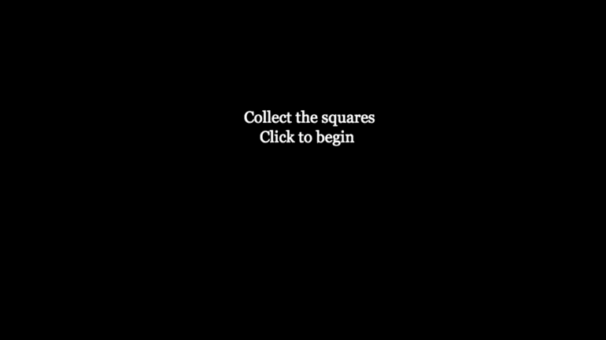

# javascript-game
A simple, fun game I made using HTML5 and Javascript 

Here is a gif showing the gameplay: 

The player scores points by aligning the red triangle under the falling green squares and loses if one reaches the bottom. 

Here is some code I would Like to highlight. 

I created the game on an HTML canvas, which is used to draw graphics: 

	<html>
	<canvas id="gameCanvas" width="800" height="600"></canvas>
	<script>

I use event listeners to track mouse clicks and scrolling: 

	canvas.addEventListener('mousemove', trackMouse);
	canvas.addEventListener('mousedown', clicked);

Then I draw the shapes, here as an example: 

	canvasContext.fillStyle = 'green';
	canvasContext.fillRect(boxX,boxY,50,50);

And have functions to move the shapes and test check if the game has ended: 

	if (boxY>canvas.height) {
		boxY= 0;
		boxX= Math.floor(Math.random()*(canvas.width-50));
		drawBox = true;
	}
	if (boxY == 450 && middlex > boxX && middlex < (boxX+50) ) {
		score ++;
		boxY= 0;
		boxX= Math.floor(Math.random()*(canvas.width-50));
	}

	if (boxY == 550) {
		gameOver = true;
	}
